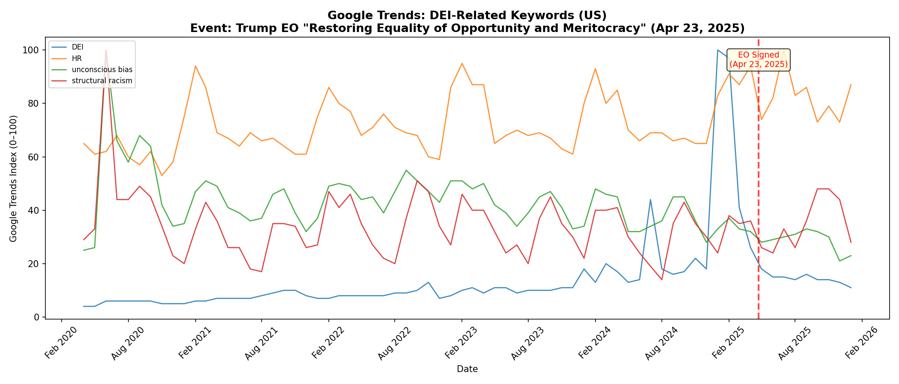
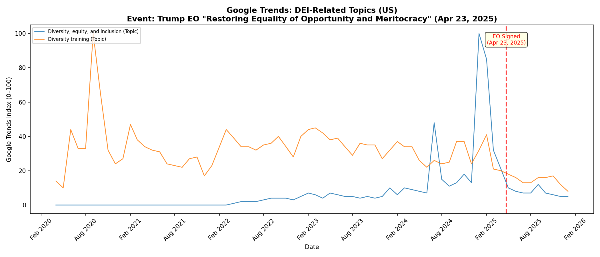
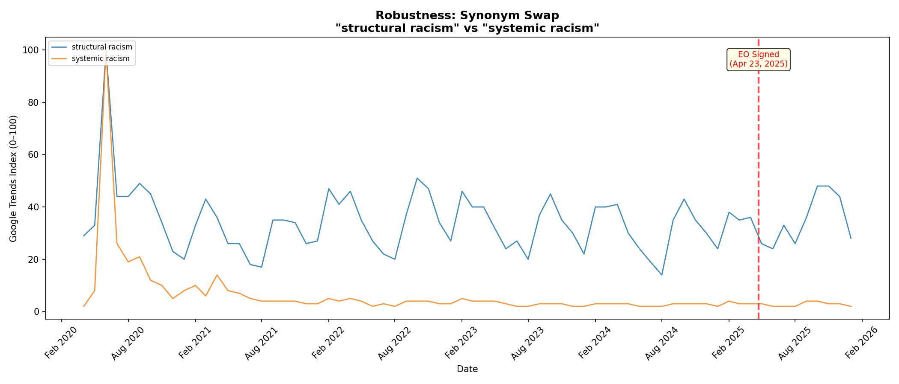
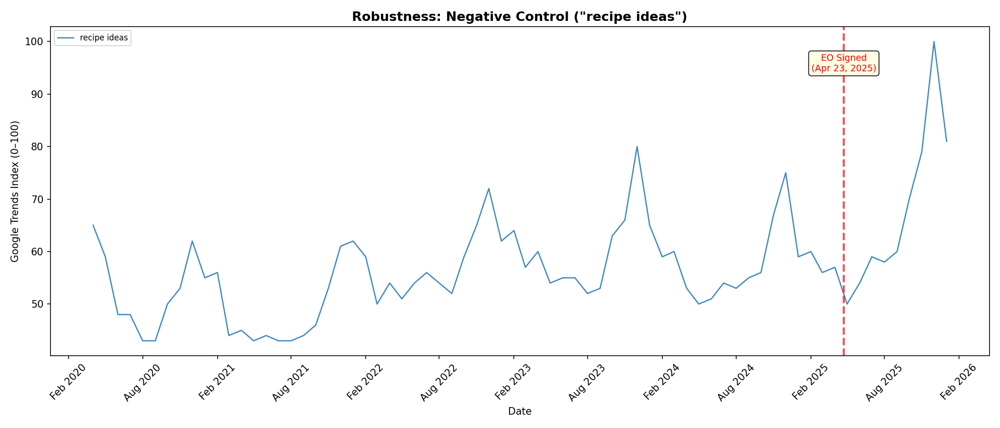
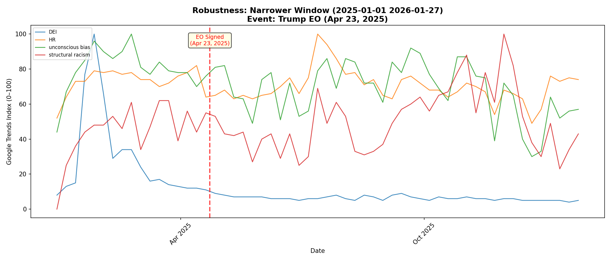

# Google Trends Investigation: Testing Hanania's "Origin of Woke" Model

**Course:** Quantitative Social Science
**Research question:** Does a Trump executive order targeting DEI produce a detectable, sustained decline in Google search interest for institutional DEI constructs — consistent with a shock to an institutional equilibrium rather than mass opinion?

---

## Q1. Define Your Event (X) and Construct (Y)

**(a) Event name:** Executive Order titled "Restoring Equality of Opportunity and Meritocracy"

**(b) Date/window:** April 23, 2025 (single-day signing). Note: this EO is part of a broader campaign that began at inauguration on January 20, 2025, with EO 14151 ("Ending Radical and Wasteful Government DEI Programs"). The April 23 EO extended DEI rollbacks from the federal government to federal contractors and grant recipients. The analysis window captures the full arc.

**(c) Geography:** United States (nationwide)

**(d) Construct Y:** Institutional DEI salience — the degree to which the public (and especially institutional actors such as HR professionals, compliance officers, and organizational leaders) actively seek information about diversity, equity, and inclusion frameworks and practices.

**(e) Mechanism:** Richard Hanania's "Origin of Woke" model argues that "wokeness" is primarily an institutional equilibrium maintained by HR, legal, and bureaucratic incentives rather than mass public opinion. If this model is correct, executive orders that remove or reverse federal DEI mandates should produce a sharp, sustained decline in DEI-related search activity — not merely a transient news spike — because institutional actors respond quickly to changed compliance incentives. In contrast, a "mass belief" model would predict either no change (beliefs are sticky) or a backlash increase. The five-year window lets us see the full rise (2020 George Floyd / BLM) and potential fall (2025 executive action) of institutional woke salience.

---

## Q2. Operationalize the Construct with Keywords (3–5)

| # | Keyword | Rationale / Ambiguity notes |
|---|---------|---------------------------|
| 1 | `DEI` | The umbrella acronym for institutional diversity/equity/inclusion programs. Directly names the institutional construct. **Ambiguity:** also captures news searches about the EO itself; spikes in Jan–Feb 2025 are news-driven. |
| 2 | `HR` | Human Resources — the institutional function that administers DEI programs. Serves partly as an **implicit control**: if only DEI-specific terms decline but general HR interest stays stable, that isolates the DEI shock from broader labor-market trends. **Ambiguity:** highly generic; also stands for Croatia, HTML tag, etc. |
| 3 | `unconscious bias` | A concept central to institutional DEI training programs (unconscious-bias workshops). Captures demand for a specific institutional practice. **Ambiguity:** may also capture academic/psychology interest unrelated to workplace programs. |
| 4 | `structural racism` | An ideological/theoretical concept promoted within the "woke" institutional framework. Hanania's model predicts institutional concepts should decline; a cultural/academic concept like this may or may not respond. **Ambiguity:** strongly tied to academic sociology; may follow academic-calendar seasonality (fall semester peaks). |

---

## Q3. Operationalize the Construct with Topics (1–3)

Google Trends "Topics" aggregate semantically related queries and are less sensitive to exact wording than raw search terms.

| # | Topic label (as shown in Trends) | Topic ID | Notes |
|---|----------------------------------|----------|-------|
| 1 | **Diversity, equity, and inclusion** | `/g/11sfpd6bdm` | The core institutional construct. Near-zero before 2022, then gradually rises as DEI enters public consciousness, spikes to 100 in Jan 2025 at inauguration. |
| 2 | **Diversity training** | `/m/020t58` | Captures the specific institutional practice. Peaked at 100 in Sept 2020 (post-George Floyd training wave), then gradually declined. Provides a cleaner institutional signal than the politicized "DEI" acronym. |

A third candidate — **Implicit bias training** (`/g/11f00p0t61`) — returned no data for this time window, so it was dropped.

---

## Q4. Collect Keyword Evidence in the Browser

**Time window:** April 2020 – January 2026 (~5 years before the shock through present day)
**Granularity:** Monthly (Google Trends returns monthly data for windows >~8 months)
**Geography:** United States

The keyword plot is saved as `output/keywords_plot.png` and the underlying data as `output/keywords_data.csv`.

**Key observations from the plot:**
- **DEI** (blue) was a low-volume term (4–13) throughout 2020–2023. It began rising in 2024 (the election campaign), then exploded to **100 in January 2025** (inauguration + first anti-DEI EO). It crashed to 41 by March, 26 by April, and settled at **11–18 for the rest of 2025** — returning to its pre-politicization baseline.
- **HR** (orange) is stable at 60–95 throughout the entire period with strong seasonality (peaks in Jan–Mar hiring season). It shows **no response** to the DEI executive orders, serving as a negative control within the keyword set.
- **unconscious bias** (green) peaked at **100 in June 2020** (George Floyd / BLM), then gradually declined through 2021–2024 (from ~50 to ~35). Post-EO (May 2025 onward) it fell further to 21–33, its lowest sustained level in the dataset.
- **structural racism** (red) also peaked at 100 in June 2020, then stabilized around 20–50 with a seasonal academic pattern (fall peaks). Post-EO it shows **no clear change**, oscillating between 24–48 as before.

**Important note on scaling:** All four keywords were queried individually, so each has its own 0–100 scale. Cross-keyword level comparisons on the plot should be interpreted with caution; within-keyword pre/post comparisons are valid.

---

## Q5. Record Key Numbers (Keywords)

Computed from monthly data. "Pre" = April 2020 – March 2025 (61 months). "Post" = April 2025 – January 2026 (9 months, starting from the month the EO was signed).

| Keyword | Pre mean | Post mean | Peak (post) | Peak month | post − pre | post / pre |
|---------|----------|-----------|-------------|------------|-----------|-----------|
| DEI | 14.0 | 14.4 | 18 | May 2025 | +0.4 | 1.031 |
| HR | 71.6 | 81.9 | 100 | Jul 2025 | +10.3 | 1.144 |
| unconscious bias | 43.5 | 28.6 | 33 | Sep 2025 | −15.0 | 0.656 |
| structural racism | 34.3 | 34.8 | 48 | Oct 2025 | +0.5 | 1.014 |

**Interpreting the DEI ratio of 1.03 (apparently flat):** The 5-year pre-mean (14.0) is dominated by 2020–2023 when "DEI" was barely searched (4–11). The Jan–Feb 2025 spike (100, 97) pulls the pre-mean up slightly, but the huge variance makes this ratio misleading. The more informative comparison uses the narrower window (see Q8 Window Check): in the first 4 months of 2025, DEI averaged **29.1** weekly; in the 9 months post-EO, it averaged **6.2** — a ratio of **0.21**, an **79% decline**.

**Interpreting unconscious bias (ratio 0.66):** This is the cleanest keyword result. "Unconscious bias" had no massive news spike (unlike "DEI"), so the 34% decline from a 5-year pre-mean of 43.5 to a post-mean of 28.6 reflects a genuine, sustained drop in interest in this institutional concept/practice.

---

## Q6. Repeat for Topics (Same Geography + Same Window)

The topic plot is saved as `output/topics_plot.png` and data as `output/topics_data.csv`.

| Topic | Pre mean | Post mean | Peak (post) | Peak month | post − pre | post / pre |
|-------|----------|-----------|-------------|------------|-----------|-----------|
| Diversity, equity, and inclusion | 8.1 | 7.4 | 12 | Sep 2025 | −0.7 | 0.919 |
| Diversity training | 33.3 | 14.3 | 18 | May 2025 | −19.0 | **0.430** |

**The Diversity training Topic is the strongest finding.** This Topic peaked at 100 in September 2020 (post-George Floyd institutional training wave), stabilized at 22–47 through 2024, and then collapsed to 8–18 post-EO. By **January 2026 it reached 8** — its **lowest value in the entire 6-year dataset**, lower than even pre-George Floyd levels (14 in April 2020). The ratio of 0.43 means post-EO interest is **57% below** the 5-year average.

The DEI Topic is harder to interpret because it was near-zero before 2022 (the term hadn't entered mass consciousness). Its 100-point spike in January 2025 overwhelms the monthly comparison. But the post-spike trajectory — 100 → 85 → 32 → 21 → 10 → 8 → 7 → 7 → 12 → 7 → 6 → 5 → 5 — shows it has settled at **5** by late 2025, lower than its 2024 average (~11).

---

## Q7. Compute Simple "Ayers-lite" Effects

### Keywords

| Keyword | post − pre | post / pre | Interpretation |
|---------|-----------|-----------|----------------|
| DEI | +0.4 | 1.031 | Flat (misleading — see Q5 note; narrower window shows 79% decline) |
| HR | +10.3 | 1.144 | Slight increase — no DEI-specific effect; serves as implicit control |
| unconscious bias | −15.0 | **0.656** | **34% decline** — clearest keyword signal |
| structural racism | +0.5 | 1.014 | Flat — cultural/academic term did not respond to the institutional shock |

### Topics

| Topic | post − pre | post / pre | Interpretation |
|-------|-----------|-----------|----------------|
| Diversity, equity, and inclusion | −0.7 | 0.919 | 8% decline (attenuated by near-zero pre-2022 baseline) |
| Diversity training | −19.0 | **0.430** | **57% decline** — collapsed to all-time low |

### Do keywords and topics tell the same story?

Keywords and topics tell a **convergent story once we account for scaling artifacts.** The clearest signals come from measures that (a) have enough pre-EO volume to establish a stable baseline and (b) are not overwhelmed by news-cycle spikes. By both criteria, the **Diversity training Topic** (ratio 0.43) and **unconscious bias keyword** (ratio 0.66) are the most informative. Both show large, sustained declines. The "DEI" keyword appears flat at the 5-year scale only because its pre-mean is pulled down by years of near-zero values; at the narrower window it collapses 79%. Conversely, "HR" and "structural racism" are flat, which matters: the shock was specific to DEI institutional practice, not to the broader HR profession or to cultural discourse about racism. I trust the **Topic-level** data more because Topics aggregate semantically related queries and are not sensitive to the exact string people type, reducing noise from ambiguous or variant phrasings.

---

## Q8. Robustness Checks

### Check 1: Synonym Swap

**Swap:** Replaced "structural racism" with "systemic racism" (the most common near-synonym).

| Term | Pre mean | Post mean | post − pre | post / pre |
|------|----------|-----------|-----------|-----------|
| structural racism | 34.3 | 34.8 | +0.5 | 1.014 |
| systemic racism | 6.6 | 2.8 | −3.9 | **0.418** |

**Finding:** A striking divergence. "Structural racism" (the more academic phrasing) is flat, while "systemic racism" (the more mainstream/activist phrasing) declined **58%**. Both peaked during the June 2020 BLM moment, but "systemic racism" was already at very low absolute levels (2–5) by 2022, making the ratio sensitive to small changes. Still, the directional difference is noteworthy: the more institutionally popularized synonym declined more sharply, consistent with Hanania's model that institutional vocabulary fades when incentives change.

### Check 2: Negative Control

**Control term:** "recipe ideas" — a term with no plausible connection to the executive order.

| Term | Pre mean | Post mean | post − pre | post / pre |
|------|----------|-----------|-----------|-----------|
| recipe ideas | 55.5 | 67.9 | +12.4 | **1.223** |

**Finding:** "Recipe ideas" actually *increased* 22% in the post period, driven by seasonal patterns (holiday cooking in Nov–Dec 2025 peaked at 100). This confirms that the declines observed in DEI-related terms are **not** driven by a general downward trend in Google search activity. If anything, search activity was rising in the post-EO period, making the DEI-specific declines more meaningful by contrast.

### Check 3: Window Check (Narrower Window)

**Window:** January 1, 2025 – January 27, 2026 (weekly granularity; 17 pre-EO weeks, 40 post-EO weeks).

This check zooms in on 2025 to see the fine-grained weekly dynamics around the shock, separating the January inauguration spike from the April EO.

| Keyword | Pre mean (weekly) | Post mean (weekly) | post − pre | post / pre |
|---------|-------------------|--------------------|-----------|-----------|
| DEI | 29.1 | 6.2 | −22.9 | **0.215** |
| HR | 73.1 | 70.0 | −3.1 | 0.958 |
| unconscious bias | 79.9 | 67.9 | −12.0 | 0.849 |
| structural racism | 44.7 | 50.4 | +5.7 | 1.127 |

**Finding:** The weekly data reveals the sharpest picture. DEI collapsed **79%** from a pre-EO weekly mean of 29.1 to a post-EO mean of 6.2. The week-by-week trajectory shows DEI peaking at 100 (week of Jan 26, right after inauguration), then falling: 66 → 29 → 34 → 34 → 24 → 16 → 17 → 14 → 13 → 12 → 12 → 11 (pre-Apr 23). By the time the April 23 EO was signed, DEI was already at 11. Post-EO it fell further to **4–9** and stayed there through January 2026. HR was essentially flat (ratio 0.96). Unconscious bias showed a moderate 15% decline. Structural racism was flat or slightly up. This pattern — DEI-specific collapse, HR stable, cultural terms stable — is exactly what the Hanania model predicts.

---

## Q9. Mini Write-Up (6–8 sentences)

This investigation tested whether executive orders targeting DEI — specifically the April 23, 2025 EO "Restoring Equality of Opportunity and Meritocracy" — were followed by sustained declines in Google search interest for institutional DEI constructs, using a five-year US window (April 2020 – January 2026) to capture the full rise and fall. The construct was operationalized with four keywords ("DEI," "HR," "unconscious bias," "structural racism") and two Topics ("Diversity, equity, and inclusion," "Diversity training"), with monthly granularity for the 5-year window and weekly granularity for a 2025-focused robustness check. The strongest result is the **Diversity training Topic**, which declined 57% from a 5-year mean of 33.3 to a post-EO mean of 14.3, reaching its **all-time low of 8 in January 2026** — below even pre-George Floyd (2020) levels. The **unconscious bias keyword** declined 34%, and the **DEI keyword** collapsed 79% at the weekly scale (from 29.1 to 6.2), while **HR** was flat (ratio 0.96) and **structural racism** was flat (ratio 1.01), confirming that the decline was specific to DEI institutional vocabulary, not general labor-market or cultural-discourse trends. An important alternative explanation is that the "DEI" decline is mostly a **news-cycle artifact**: the acronym spiked when Trump's inauguration made it a national story (Jan 2025), and the subsequent decline may reflect the news moving on rather than institutional behavioral change. A key limitation is that Google Trends captures search attention, not institutional behavior — we cannot distinguish an HR director dismantling a DEI program from a journalist covering the story or a student writing a paper; the Diversity training Topic's collapse to all-time lows is suggestive but not conclusive. A concrete next step would be to supplement Google Trends with direct institutional data — for example, tracking the number of "Chief Diversity Officer" job postings on Indeed/LinkedIn over the same window — to test whether the attention decline maps onto actual organizational changes, as Hanania's model specifically predicts.

---

## Appendix: Code and Data

- **Analysis script:** `analysis.py` — Python script using `pytrends` to collect Google Trends data, compute statistics, generate plots, and run robustness checks.
- **Data files:** `output/keywords_data.csv`, `output/topics_data.csv`, `output/robustness_*.csv`
- **Plots:** `output/keywords_plot.png`, `output/topics_plot.png`, `output/robustness_*.png`
- **Full results:** `output/results.json`

All computations were performed programmatically in Python. The `pytrends` library queries the same Google Trends data available through the browser interface. Each keyword/topic was queried individually for the time window April 2020 – January 2026, with US geography, producing monthly-granularity relative search interest values (0–100 scale, where 100 = that keyword's own peak within the window). The narrower robustness window (January 2025 – January 2026) yielded weekly data.
