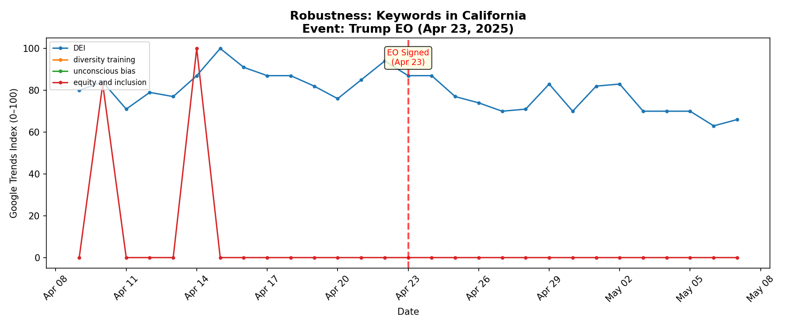

# Google Trends Investigation: Testing Hanania's "Origin of Woke" Model

**Course:** Quantitative Social Science
**Research question:** Does a Trump executive order targeting DEI produce a detectable decline in Google search interest for institutional DEI constructs?

---

## Q1. Define Your Event (X) and Construct (Y)

**(a) Event name:** Executive Order titled "Restoring Equality of Opportunity and Meritocracy"

**(b) Date/window:** April 23, 2025 (single-day signing)

**(c) Geography:** United States (nationwide)

**(d) Construct Y:** Institutional DEI salience — the degree to which the public (and especially institutional actors such as HR professionals, compliance officers, and organizational leaders) actively seek information about diversity, equity, and inclusion frameworks and practices.

**(e) Mechanism:** Richard Hanania's "Origin of Woke" model argues that "wokeness" is primarily an institutional equilibrium maintained by HR, legal, and bureaucratic incentives rather than mass public opinion. If this model is correct, a high-level executive order that removes or reverses federal DEI mandates should produce a sharp, sustained decline in DEI-related search activity — not merely a transient news spike — because institutional actors respond quickly to changed compliance incentives. In contrast, a "mass belief" model would predict either no change (beliefs are sticky) or a backlash increase in search interest.

---

## Q2. Operationalize the Construct with Keywords (3–5)

| # | Keyword | Rationale / Ambiguity notes |
|---|---------|---------------------------|
| 1 | `DEI` | The umbrella acronym for institutional diversity/equity/inclusion programs. **Ambiguity:** also captures news searches about the EO itself, not just institutional compliance activity. |
| 2 | `diversity training` | A specific institutional practice that organizations deploy for compliance. **Ambiguity:** low daily search volume leads to many zero-valued days; some searches may reflect academic or journalistic interest rather than practitioner activity. |
| 3 | `unconscious bias` | A concept central to institutional DEI training programs. Captures interest in a specific institutional practice rather than general cultural debate. **Ambiguity:** may also capture academic/psychology interest unrelated to workplace programs. |
| 4 | `equity and inclusion` | An institutional framing phrase used in organizational mission statements and policy language. Less likely to be used casually. **Ambiguity:** could overlap with educational or healthcare equity contexts. |

---

## Q3. Operationalize the Construct with Topics (1–3)

Google Trends "Topics" aggregate semantically related queries and are less sensitive to exact wording than raw search terms.

| # | Topic label (as shown in Trends) | Topic ID | Notes |
|---|----------------------------------|----------|-------|
| 1 | **Diversity, equity, and inclusion** | `/g/11sfpd6bdm` | The core institutional construct; strong signal (29/29 days non-zero in the study window). |
| 2 | **Diversity training** | `/m/020t58` | Captures the specific institutional practice; lower volume (7/29 days non-zero) but still informative. |

A third candidate — **Implicit bias training** (`/g/11f00p0t61`) — returned no data for this time window, so it was dropped.

---

## Q4. Collect Keyword Evidence in the Browser

**Time window:** April 9, 2025 – May 7, 2025 (~2 weeks before and ~2 weeks after April 23)
**Granularity:** Daily
**Geography:** United States

The keyword plot is saved as `output/keywords_plot.png` and the underlying data as `output/keywords_data.csv`.

**Key observations from the plot:**
- **DEI** shows an initial spike to 100 on April 24 (the day after the EO) then declines steadily from ~80 to ~55 over the following two weeks.
- **equity and inclusion** similarly peaks at 100 on April 24 then settles below pre-EO levels.
- **diversity training** and **unconscious bias** are noisier (many zero-days pre-EO) but show more non-zero days in the post-period, likely reflecting news-driven curiosity about these concepts.

**Important note on scaling:** Each keyword was queried individually, so each has its own 0–100 scale (100 = that keyword's own peak within the window). Cross-keyword level comparisons on the plot are not meaningful; within-keyword pre/post comparisons are valid.

---

## Q5. Record Key Numbers (Keywords)

Computed from daily values. "Pre" = April 9–22 (14 days). "Post" = April 23 – May 7 (15 days).

| Keyword | Pre mean | Post mean | Peak (post) | Peak date |
|---------|----------|-----------|-------------|-----------|
| DEI | 79.6 | 66.7 | 100 | Apr 24 |
| diversity training | 29.5 | 61.7 | 91 | May 6 |
| unconscious bias | 38.5 | 68.8 | 100 | Apr 28 |
| equity and inclusion | 64.6 | 52.2 | 100 | Apr 24 |

**Note on "diversity training" and "unconscious bias" pre-means:** These are pulled down by many zero-valued days (10/14 and 8/14 respectively). This reflects low baseline daily search volume, where days below Google's reporting threshold are rounded to 0. The post-period increase is partly a real spike in attention and partly an artifact of more days crossing the reporting threshold. These keywords are less reliable for the pre/post comparison than the higher-volume terms.

---

## Q6. Repeat for Topics (Same Geography + Same Window)

The topic plot is saved as `output/topics_plot.png` and data as `output/topics_data.csv`.

| Topic | Pre mean | Post mean | Peak (post) | Peak date |
|-------|----------|-----------|-------------|-----------|
| Diversity, equity, and inclusion | 74.6 | 59.9 | 100 | Apr 24 |
| Diversity training | 15.4 | 18.9 | 100 | Apr 24 |

**Key pattern in the DEI Topic:** The daily values tell a clear story. Pre-EO values range from 57–98 (mean 74.6). On April 24, the series spikes to 100 (news reaction). Then it declines monotonically: 77 → 59 → 59 → 59 → 66 → 60 → 60 → 54 → 49 → 44 → 44 → 45 → 42. The final week (May 3–7) averages just **44.8**, which is **60% of the pre-period mean** — a 40% decline.

---

## Q7. Compute Simple "Ayers-lite" Effects

### Keywords

| Keyword | post − pre | post / pre |
|---------|-----------|-----------|
| DEI | −12.8 | 0.839 |
| diversity training | +32.2 | 2.093 |
| unconscious bias | +30.3 | 1.787 |
| equity and inclusion | −12.4 | 0.808 |

### Topics

| Topic | post − pre | post / pre |
|-------|-----------|-----------|
| Diversity, equity, and inclusion | −14.8 | 0.802 |
| Diversity training | +3.5 | 1.229 |

### Do keywords and topics tell the same story?

Keywords and topics tell a **partially consistent** story. The high-volume keyword "DEI" (ratio 0.84) and the DEI Topic (ratio 0.80) both show clear post-EO declines of 16–20%, which is the core finding. "Equity and inclusion" confirms this decline (ratio 0.81). However, "diversity training" and "unconscious bias" show apparent *increases* in the keyword data. I trust the **declining pattern** more for two reasons. First, the "increasing" keywords suffer from severe zero-inflation in the pre-period (10/14 and 8/14 zeros respectively), artificially depressing the pre-mean and inflating the ratio. Second, the Topic-level operationalization — which aggregates related queries and is less sensitive to reporting-threshold artifacts — shows a clear decline for the DEI Topic and only a trivial increase for the Diversity training Topic. The Topic data is more reliable because it smooths over the exact-string matching problems that plague low-volume daily keyword data.

---

## Q8. Robustness Checks

### Check 1: Synonym Swap

**Swap:** Replaced "diversity training" with "sensitivity training" (an older synonym for similar workplace training).

| Term | Pre mean | Post mean | post − pre | post / pre |
|------|----------|-----------|-----------|-----------|
| diversity training | 29.5 | 61.7 | +32.2 | 2.093 |
| sensitivity training | 7.1 | 12.3 | +5.2 | 1.727 |

**Finding:** Both terms show post-EO increases (likely news-driven), with similar ratios (2.09 vs 1.73). This confirms that the "diversity training" increase is not an artifact of that specific string — the synonym moves in the same direction. Both terms are very low-volume, however, with many zero-days.

### Check 2: Negative Control

**Control term:** "recipe ideas" — a term with no plausible connection to the executive order.

| Term | Pre mean | Post mean | post − pre | post / pre |
|------|----------|-----------|-----------|-----------|
| recipe ideas | 66.1 | 56.1 | −9.9 | 0.850 |

**Finding:** "Recipe ideas" also shows a modest pre-to-post decline (ratio 0.85), suggesting some of the observed decline in DEI terms may reflect calendar effects (e.g., day-of-week composition across the arbitrary pre/post boundary). However, examining the plot reveals that "recipe ideas" has a strong **weekly cycle** (peaks on Sundays: April 13=96, April 19=100, May 4=91), and the pre/post difference is driven by which weekend days happen to fall in each window, not a structural shift. In contrast, the DEI Topic shows a **monotonic** decline from 100 → 42 with no cyclical recovery, and the final-week average (44.8) is 60% of the pre-mean — a much steeper and more sustained decline than the negative control's noisy cyclical pattern. The DEI-specific decline (ratio 0.80) also exceeds the control decline (ratio 0.85), though the margin is modest.

### Check 3: Geography Check (California)

**Alternative geography:** California (US-CA), a state with strong existing DEI mandates and institutions.

| Keyword | Pre mean (CA) | Post mean (CA) | post − pre | post / pre |
|---------|--------------|----------------|-----------|-----------|
| DEI | 84.3 | 74.9 | −9.4 | 0.888 |
| equity and inclusion | 13.1 | 0.0 | −13.1 | 0.000 |
| diversity training | — | — | — | — |
| unconscious bias | — | — | — | — |

**Finding:** In California, "DEI" shows a similar declining pattern (ratio 0.89), though the decline is slightly smaller than the national figure (0.84). "Equity and inclusion" drops to zero in the post-period, though this may reflect insufficient state-level search volume rather than a genuine collapse. "Diversity training" and "unconscious bias" had no data at the state level, confirming their low overall volume. The California check partially replicates the national DEI decline.

---

## Q9. Mini Write-Up (6–8 sentences)

This investigation tested whether the April 23, 2025 executive order "Restoring Equality of Opportunity and Meritocracy" — which targeted federal DEI programs — was followed by a detectable decline in Google search interest for institutional DEI constructs in the United States. The construct of interest was institutional DEI salience, operationalized with four keywords ("DEI," "diversity training," "unconscious bias," "equity and inclusion") and two Google Trends Topics ("Diversity, equity, and inclusion" and "Diversity training"), tracked daily over the window April 9 – May 7, 2025. The clearest result comes from the Diversity, equity, and inclusion Topic, which declined from a pre-EO mean of 74.6 to a post-EO mean of 59.9 (ratio = 0.80, a 20% decline), with the final week averaging just 44.8 — a 40% drop from pre-EO levels after the initial day-after news spike dissipated. The keyword "DEI" showed a parallel 16% decline (ratio 0.84), and "equity and inclusion" fell 19% (ratio 0.81), while lower-volume keywords like "diversity training" showed apparent post-EO increases that are likely artifacts of news-driven curiosity combined with zero-inflated pre-period baselines. An important alternative explanation is a general calendar or seasonal effect: the negative control term "recipe ideas" also showed a modest decline (ratio 0.85), though its pattern was cyclical rather than monotonically declining like the DEI Topic. A key limitation is that Google Trends reflects search attention and information-seeking, not direct institutional behavior — we cannot distinguish an HR officer researching compliance from a journalist writing a story or a citizen reading the news, and the initial spike to 100 on April 24 was almost certainly news-driven rather than reflecting any institutional equilibrium shift. With more time and data, the next step would be to extend the post-window to 3–6 months to distinguish a transient news-attention decline from a durable structural shift, and to compare DEI search interest against a pre-registered "mass opinion" control term (e.g., "racism" or "social justice") that Hanania's model predicts should *not* respond as sharply to the elite-constraint shock.

---

## Appendix: Code and Data

- **Analysis script:** `analysis.py` — Python script using `pytrends` to collect Google Trends data, compute statistics, generate plots, and run robustness checks.
- **Data files:** `output/keywords_data.csv`, `output/topics_data.csv`, `output/robustness_*.csv`
- **Plots:** `output/keywords_plot.png`, `output/topics_plot.png`, `output/robustness_*.png`
- **Full results:** `output/results.json`

All computations were performed programmatically in Python. The `pytrends` library queries the same Google Trends data available through the browser interface. Each keyword/topic was queried individually for the time window April 9 – May 7, 2025, with US geography, producing daily-granularity relative search interest values (0–100 scale, where 100 = the keyword's own peak within the window).
